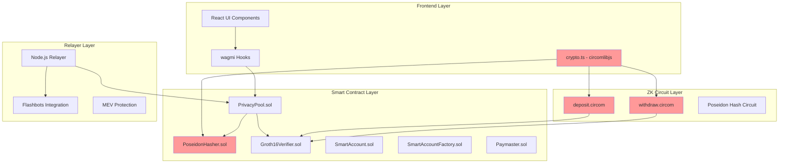
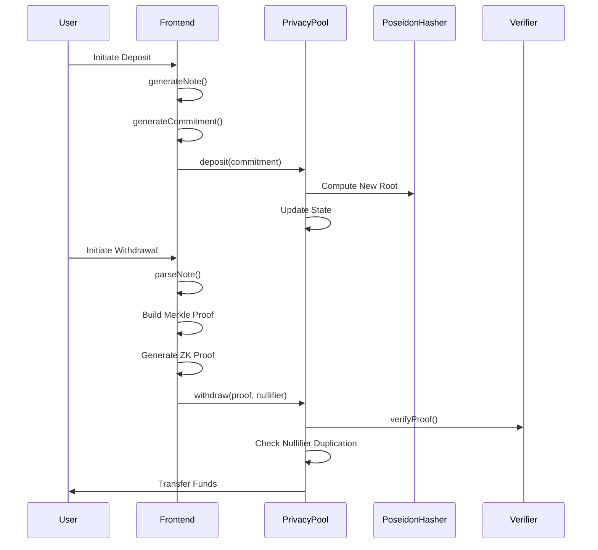
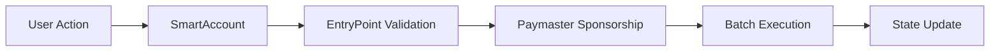
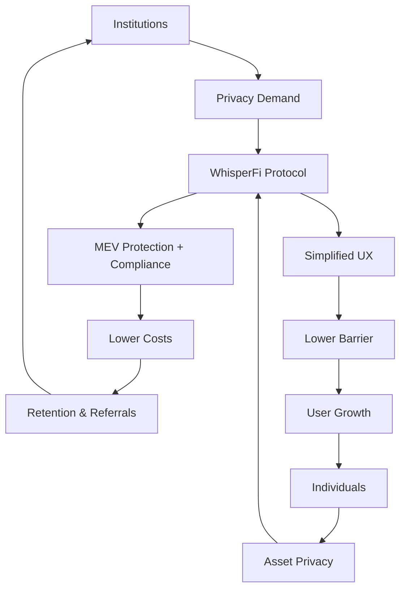

# WhisperFi – Next-Gen DeFi Privacy Infrastructure

[[中文文档](./README_CN.md)]

WhisperFi is a privacy-preserving DeFi protocol built on zero-knowledge proofs and account abstraction. It leverages ZK-SNARKs (Groth16) for on-chain transaction confidentiality and integrates ERC-4337 to deliver secure, seamless user experiences.

---

## System Architecture



---

## Core Features

### Zero-Knowledge Private Transaction System

#### Technical Implementation

The system employs Groth16 ZK-SNARKs for privacy. Core components include Poseidon hashing, Merkle tree state management, and zk-proof verification. The frontend generates commitments via `generateCommitment()`, maintaining a fixed-depth 16 Merkle tree of historical commitments.



#### Cross-Domain Hash Consistency Solution

Solved critical inconsistency in Poseidon hash computation across JavaScript (`circomlibjs`), Solidity, and Circom circuits. Unified bytecode generated via `deploy-poseidon.ts` using `poseidonContract.createCode(2)` ensures cryptographic consistency — establishing a trusted foundation for the entire system.

---

### Account Abstraction System

#### Full ERC-4337 Implementation

Complete AA stack including EntryPoint, SmartAccountFactory, and Paymaster. SmartAccountFactory uses CREATE2 for deterministic address generation, supporting `getAccountAddress()` precomputation and `createAccount()` deployment. Enables Gas abstraction, batched transactions, and social recovery via UserOperation standard.

#### User Operation Flow



---

### MEV Protection & Relayer System

#### Private Mempool Integration

Node.js relayer integrates Flashbots infrastructure to submit private transactions into protected mempools. Monitors on-chain events, processes zk-proofs, and enforces MEV-resistant execution at intended prices.

---

## Project Structure

```
private-deFi /
├── contracts/                    # Smart Contracts
│   ├── PrivacyPool.sol           # Core Privacy Pool
│   ├── Groth16Verifier.sol       # ZKP Verifier
│   ├── SmartAccount.sol          # ERC-4337 AA
│   ├── SmartAccountFactory.sol   # Factory Contract
│   ├── Paymaster.sol             # Gas Sponsorship
│   └── lib/                      # Utilities & Interfaces
├── circuits/                     # ZK Circuits
│   ├── deposit.circom            # Deposit Proof
│   ├── withdraw.circom           # Withdraw Proof
│   ├── merkle.circom             # Merkle Verification
│   └── build/                    # Compiled Artifacts
├── frontend/                     # React App
│   ├── src/components/           # UI Components
│   ├── src/utils/crypto.ts       # Core Crypto Logic
│   ├── src/config/contracts.ts   # Contract Configs
│   └── public/zk/                # ZK Assets
├── relayer/                      # Relayer Service
│   ├── index.js                  # Main Server
│   ├── processor.js              # Tx Processor
│   └── flashbots.js              # MEV Protection
├── test/                         # Test Suite
│   ├── PrivacyPool.test.ts       # Contract Tests
│   ├── zk-proof-generation.test.ts # ZK Integration
│   └── AA-E2E.test.ts            # End-to-End Tests
└── scripts/                      # Deployment Scripts
    ├── deploy.ts                 # Main Deploy Script
    └── deploy-poseidon.ts        # Hash Contract Deploy
```

---

## Repository

Main Repo: [Wenbobobo/WhisperFi](https://github.com/Wenbobobo/WhisperFi)

---

## Team

**Wenbo** – Product Architect
Led core product design and implementation.

**Xiao** – Financial Architect
Conducted market/user research and risk-assessed economic models.

**JT** – Research Lead
Specialized in ZKPs and DeFi architecture; solved cross-domain hash consistency and led system design.

---

## Business Model & Market Analysis

### Target User Ecosystem

WhisperFi serves three core segments:

- Institutional traders seeking privacy + MEV protection in DeFi;
- High-net-worth individuals requiring asset privacy + compliance reporting;
- DeFi developers integrating privacy infrastructure.

According to DeFi Pulse, the total value locked (TVL) in DeFi currently exceeds \$40 billion, with institutional capital accounting for approximately 35% — representing a potential addressable market of around \$14 billion.

### User Value Flywheel



### Economic Design

As a public privacy interaction protocol, WhisperFi aspires to become the next-generation privacy infrastructure within the Ethereum ecosystem.

In its early stages, the project prioritizes building a secure technical foundation, delivering frictionless user experiences, and driving broad adoption — not short-term monetization.

We have designed a multi-layered revenue model:

Base Layer: Transaction fees provide stable, foundational cash flow.
Growth Layer: Future expansion into premium services — including compliance reporting, high-performance API access, and custom privacy solutions — will diversify revenue streams and ensure long-term sustainability.

---

## Testing & Validation

- Test coverage & guide: see `docs/TESTING_GUIDE.md`

---

## Deck & Demo

ETHShenzhen 2025:
- Deck: [https://gamma.app/docs/WhisperFiDeFi-7zs285h46cii4ja](https://gamma.app/docs/WhisperFiDeFi-7zs285h46cii4ja)
- Video: [https://drive.google.com/file/d/15UAjsHKs0esPyJCjoD4eR4D0RpRgGbyt/view?usp=drive_link](https://drive.google.com/file/d/15UAjsHKs0esPyJCjoD4eR4D0RpRgGbyt/view?usp=drive_link)

Demo highlights: ZK proof generation/verification, full private deposit/withdraw flow, sub-account creation, anonymous trading. All core functions operational.

WhisperFi solves critical privacy challenges in DeFi through technical innovation — building next-gen Ethereum privacy infrastructure for institutional and professional users.

**Proud Winner of ETHShenzhen 2025 Hackathon (1st Place)**