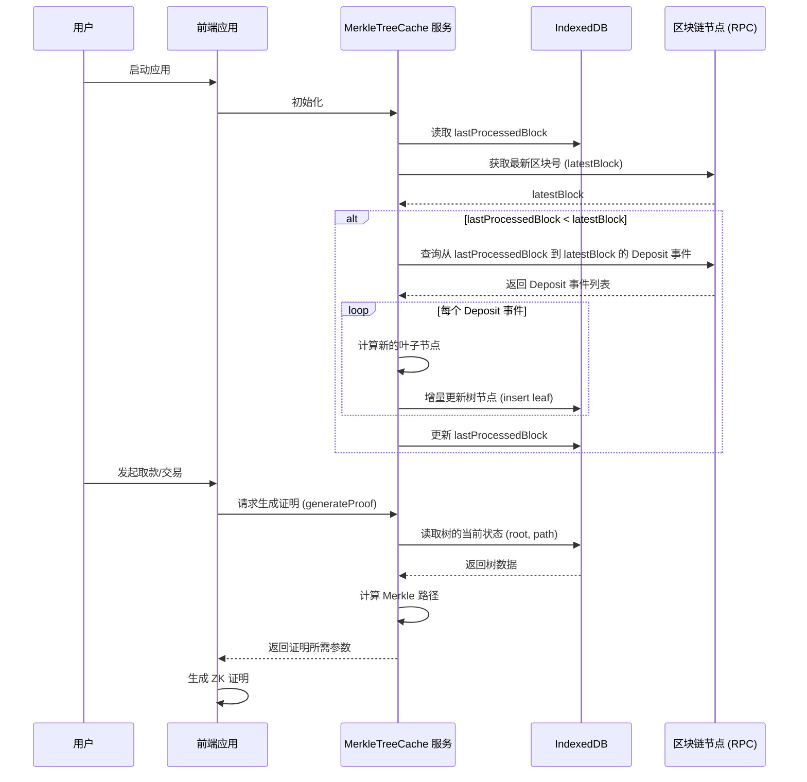
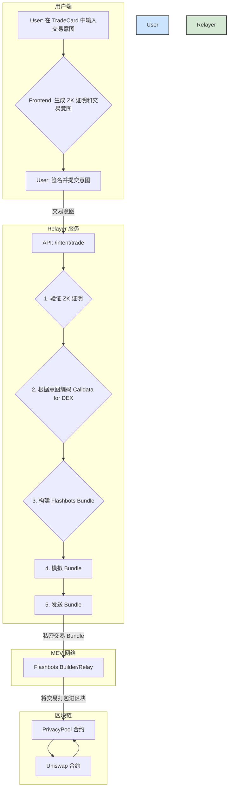

# 技术规划报告：核心交易功能与性能优化

**版本:** 1.0
**日期:** 2025-07-27
**作者:** Kilo Code

## 1. 引言

随着第一阶段核心功能的成功交付，本项目已验证了基于 ZK-SNARKs 和账户抽象（AA）的隐私交易框架的可行性。为了迎接下一阶段的挑战——实现核心的匿名交易功能并解决关键性能瓶颈，本报告旨在进行深入的技术预研和方案设计，为下一阶段的开发提供清晰、可执行的路线图。

本报告将围绕以下两个核心主题展开：

1.  **前端 Merkle 树性能优化**: 解决当前前端在生成证明时因 Merkle 树同步和构建而导致的性能问题。
2.  **核心交易功能 (`TradeCard`) 与 Relayer**: 设计并规划支持与 DEX 进行匿名交互的核心交易流程。

---

## 2. 主题一：前端 Merkle 树性能优化

### 2.1 问题分析

**核心瓶颈：** 当前前端应用在每次生成 ZK 证明（无论是取款还是未来的交易）之前，都需要执行以下耗时操作：
1.  从区块链节点（通过 RPC 调用）获取所有历史 `Deposit` 事件。
2.  在客户端内存中，从零开始重新构建完整的 Merkle 树。

随着 `Deposit` 事件数量的增加，这个过程的延迟会变得越来越长，严重影响用户体验。在拥有数千或数万个叶子节点的树中，这个过程可能需要几十秒甚至更长时间，这对于一个要求高响应速度的金融应用来说是不可接受的。

### 2.2 方案调研

为了解决上述问题，我们需要一个能够在浏览器环境中持久化存储 Merkle 树，并支持增量更新的方案。

#### 2.2.1 存储方案：IndexedDB

**IndexedDB** 是现代浏览器内置的、功能强大的客户端数据库。它是我们首选的持久化存储方案。

*   **优点:**
    *   **大容量存储:** 相比 `localStorage`（通常只有 5-10MB），IndexedDB 可以存储大量数据（通常是 GB 级别，取决于用户磁盘空间和浏览器策略），足以容纳大规模的 Merkle 树节点。
    *   **异步 API:** 所有操作都是异步的，不会阻塞浏览器主线程，保证了 UI 的流畅性。
    *   **事务支持:** 支持原子性的读写操作，确保了数据的一致性，这对于维护 Merkle 树的完整性至关重要。
    *   **索引支持:** 可以创建索引来加速数据查询，虽然对于 Merkle 树的层级结构不一定直接适用，但可以用来高效地存储和检索叶子节点。
*   **缺点:**
    *   **API 相对复杂:** 相比 `localStorage`，其 API 更为底层和繁琐。但可以通过使用 `dexie.js` 等封装库来极大地简化操作。
    *   **浏览器兼容性:** 虽然主流浏览器（Chrome, Firefox, Safari, Edge）都支持，但在一些非常老旧的浏览器或非标准环境中可能存在问题（这在我们的目标用户群体中风险较低）。

#### 2.2.2 Merkle 树库调研

我们需要一个能够与持久化存储结合，并支持高效增量更新的 Merkle 树库。

*   **`fixed-merkle-tree`**:
    *   **优点:** 这是一个专门为零知识证明应用设计的库，被 Tornado Cash 等知名项目使用。它性能高，API 简洁，并且其内部数据结构（按层级存储节点）非常适合与 IndexedDB 结合。它原生支持增量更新（`insert` 方法）。
    *   **缺点:** 它本身不包含持久化逻辑，需要我们自己实现与 IndexedDB 的对接。
*   **从零实现 (不推荐):**
    *   虽然可以自己实现一个 Merkle 树，但这需要投入大量时间来确保其正确性、安全性和性能，属于“重复造轮子”。考虑到 `fixed-merkle-tree` 的成熟度和可靠性，我们应优先选择它。

**结论：** 我们将采用 **`dexie.js` (作为 IndexedDB 的封装) + `fixed-merkle-tree`** 的技术栈。`dexie.js` 负责与数据库的高效交互，`fixed-merkle-tree` 负责核心的树逻辑计算。

### 2.3 方案设计

#### 2.3.1 基于 IndexedDB 的缓存方案

我们将创建一个 `MerkleTreeCache` 服务，该服务负责管理 Merkle 树的本地状态，并与链上事件保持同步。

**数据模型 (IndexedDB):**

我们将创建两个表 (Object Stores):

1.  `treeNodes`: 用于存储 Merkle 树的节点。
    *   `key`: `level-index` (例如, `0-0`, `1-0`, `1-1`)
    *   `value`: `bytes32` (节点的哈希值)
2.  `metadata`: 用于存储元数据。
    *   `key`: `string` (例如, `lastProcessedBlock`, `nextLeafIndex`)
    *   `value`: `any`

**数据同步与更新流程 (Mermaid 图):**



#### 2.3.2 主要实现步骤与工作量预估

1.  **环境搭建 (0.5 天):**
    *   引入 `dexie.js` 和 `fixed-merkle-tree` 库。
    *   配置 `dexie.js` 数据库和表结构。

2.  **实现 `MerkleTreeCache` 服务 (2 天):**
    *   实现 `init()` 方法：负责初始化数据库，从 IndexedDB 加载树，并与链上事件进行首次同步。
    *   实现 `syncEvents()` 方法：监听新的 `Deposit` 事件，并增量更新本地树。可以使用 `viem` 或 `ethers` 的 `watchContractEvent` 功能。
    *   实现 `getProof(leafIndex)` 方法：根据叶子索引，从 IndexedDB 中高效地获取生成证明所需的 Merkle 路径和根。

3.  **重构现有组件 (1 天):**
    *   修改 `DepositCard` 和 `WithdrawCard`（以及未来的 `TradeCard`），使其不再从零构建树，而是调用 `MerkleTreeCache` 服务来获取证明参数。
    *   更新 UI 以反映树的同步状态（例如，显示“同步中...”、“已同步”）。

4.  **编写单元和集成测试 (1.5 天):**
    *   为 `MerkleTreeCache` 服务编写详细的单元测试，模拟事件同步和证明生成。
    *   编写集成测试，确保重构后的组件能够正确生成有效的证明。

**总预估工作量：** 约 **5 人天**。
---

## 3. 主题二：核心交易功能 (`TradeCard`) 与 Relayer

### 3.1 需求梳理

`TradeCard` 是实现项目核心价值的关键组件。它允许用户利用其在 `PrivacyPool` 中的存款，以匿名的方式与外部 DeFi 协议（如 Uniswap）进行交互。

**核心功能:**

1.  **输入选择:**
    *   用户选择一个自己拥有的、未花费的存款（Note）。
    *   用户选择一个目标 DEX（初期可限定为 Uniswap V2/V3）。
    *   用户输入希望交换的代币对（例如，ETH -> DAI）和数量。
2.  **输出生成:**
    *   用户在本地生成一个新的 Note，用于接收交易后剩余的资金。
3.  **证明生成:**
    *   前端根据用户的输入，在本地生成一个 ZK 证明。该证明能够证实用户拥有一个合法的存款，但不会泄露是哪一个。
4.  **交易意图提交:**
    *   用户将生成的证明和交易意图（例如，希望在 Uniswap 用 0.05 ETH 购买 DAI）发送给 Relayer。

**ZK 电路 (`trade.circom`) 的输入/输出分析:**

根据我们对 `circuits/trade.circom` 的分析，电路需要处理以下信号：

*   **私有输入 (Private Inputs):**
    *   `oldSecret`, `oldAmount`: 旧 Note 的信息，用于证明所有权。
    *   `merklePath`: 旧 Note 在 Merkle 树中的路径，用于证明其存在。
    *   `newSecret`, `newAmount`: 新 Note 的信息，用于接收找零。
*   **公共输入 (Public Inputs):**
    *   `merkleRoot`: 用于验证 Merkle 路径的根。
    *   `nullifier`: 用于作废旧 Note，防止双花。
    *   `newCommitment`: 新 Note 的 Commitment，将被插入到树中。
    *   `tradeDataHash`: 交易意图的哈希，确保 Relayer 执行的是用户授权的操作。
    *   `recipient`: 接收交易输出代币的地址（通常是 `PrivacyPool` 合约自身或其控制的地址）。
    *   `tradeAmount`: 用于交易的金额。

### 3.2 Relayer 依赖分析

当前的 `relayer/index.js` 仅包含一个 `/relay/trade` 端点，且实现非常基础。为了支持真正的隐私交易，需要进行大量增强。

**差距分析:**

1.  **缺乏交易编码能力:** 当前 Relayer 只是简单地将用户提供的 `callData` 透传给合约。它需要能够根据用户的意图（如 "Swap 0.05 ETH for DAI on Uniswap"）自行编码生成正确的 `callData`。
2.  **无 Gas 费和滑点处理:** 没有处理 Gas 费预估、支付以及交易滑点控制的逻辑。
3.  **非抗 MEV:** 交易直接以明文形式发送到公共内存池，极易受到 MEV 攻击（如三明治攻击）。
4.  **状态管理缺失:** 没有数据库来跟踪已提交的交易状态。

**新增 API 端点设计:**

*   `POST /intent/trade`:
    *   **功能:** 接收用户的“交易意图”，而不是完整的交易参数。这更安全、更用户友好。
    *   **请求体 (Body):**
        ```json
        {
          "proof": { "pA": [...], "pB": [...], "pC": [...] },
          "publicSignals": {
            "merkleRoot": "0x...",
            "nullifier": "0x...",
            "newCommitment": "0x..."
          },
          "intent": {
            "dex": "Uniswap_V3",
            "tokenIn": "ETH",
            "tokenOut": "DAI",
            "amountIn": "0.05",
            "slippage": "0.5%" 
          }
        }
        ```
    *   **响应 (Response):**
        ```json
        { "status": "pending", "intentId": "some-unique-id" }
        ```
*   `GET /intent/status/:intentId`:
    *   **功能:** 允许前端查询交易意图的处理状态（pending, submitted, confirmed, failed）。

**与 Flashbots 集成 (抗 MEV):**

为了实现真正的抗 MEV，Relayer 不能直接将交易广播到公共内存池。它必须通过私密交易网络（如 Flashbots）来提交交易。

*   **关键技术点:**
    1.  **使用 `ethers-provider-flashbots`:** 这是与 Flashbots 中继交互的标准库。
    2.  **构建 Bundle:** Relayer 需要将用户的交易打包成一个 Flashbots "Bundle"。一个典型的 Bundle 至少包含两笔交易：
        *   **交易1 (可选):** Relayer 自己向 Builder 支付 Gas 费的交易。
        *   **交易2:** 用户的 `PrivacyPool.trade()` 调用。
    3.  **模拟与发送:** 在发送 Bundle 之前，必须先调用 `flashbotsProvider.simulate()` 来确保交易会成功并且不会被 revert。模拟成功后，再通过 `flashbotsProvider.sendBundle()` 发送。
    4.  **信誉系统:** Flashbots 对 Builder 和 Searcher 有信誉要求。我们的 Relayer 需要维护一个可靠的私钥，并避免发送会失败的交易，以建立良好的信誉。

### 3.3 高层架构设计

**完整的隐私交易流程 (Mermaid 图):**



### 3.4 主要实现步骤与工作量预估

1.  **Relayer 增强 (4 天):**
    *   集成 `ethers-provider-flashbots`。
    *   实现 `POST /intent/trade` 和 `GET /intent/status/:intentId` 端点。
    *   添加数据库（如 SQLite 或 PostgreSQL）来存储和管理交易意图的状态。
    *   实现 Uniswap V3 `calldata` 的编码逻辑（可以使用 Uniswap SDK）。

2.  **合约调整 (1 天):**
    *   对 `PrivacyPool.sol` 的 `trade` 函数进行微调，确保其能与 Relayer 的 `calldata` 正确交互。
    *   编写并执行一个完整的部署和验证脚本。

3.  **前端 `TradeCard` 组件开发 (3 天):**
    *   构建 `TradeCard` 的 UI，包括代币选择、数量输入等。
    *   集成与 `/intent/trade` API 的交互逻辑。
    *   处理交易的生命周期状态（pending, success, error）并向用户提供清晰的反馈。

4.  **端到端测试 (2 天):**
    *   在本地测试环境中（Hardhat + 本地 Relayer）编写一个完整的端到端测试，模拟从用户意图到链上交易确认的全过程。

**总预估工作量：** 约 **10 人天**。

---

## 4. 总结与后续步骤

本报告详细分析了下一阶段开发中的两个核心主题，并给出了具体的技术方案、架构设计和工作量预估。

*   **总预估工作量:** 15 人天。
*   **建议:** 鉴于两个主题的独立性，可以并行开发以缩短交付周期。

**下一步行动:**

1.  **评审:** 与团队评审此技术规划报告，收集反馈并进行调整。
2.  **任务拆分:** 将上述实现步骤拆分为具体的开发任务，并分配到项目管理工具中。
3.  **模式切换:** 请求切换到 `code` 模式，开始具体的编码实现工作。