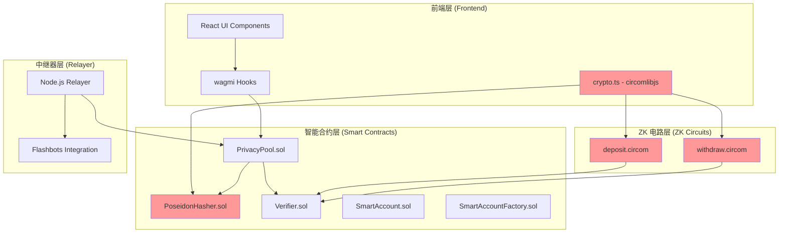

# 技术规格与开发蓝图 v2.0

**文档目的**: 本文档是项目的"单一事实来源 (Single Source of Truth)"，旨在取代所有旧的、分散的计划和跟踪文件。它将为所有现有和未来的贡献者，提供一个关于项目战略、架构、功能规格、接口定义和开发状态的、清晰、详实且唯一的指南。

**重大更新 (v2.0)**: 本版本反映了项目在 Poseidon 哈希实现方面的重大架构改进，以及"可信根基"计划的完成状态。

---

## 第一部分：战略与架构

### 1.1 核心定位与优势

- **核心定位**: 为专业交易者和注重隐私的用户，提供一个在功能上超越竞品、在体验上达到业界顶级的、更安全、更易用、更强大的下一代隐私 DeFi 协议。
- **核心优势**: 独特的 **"强隐私核心 (ZK) + 极致体验层 (AA)"** 混合架构。
- **技术特色**: 通过链下生成字节码的方式，实现了前端、链上合约和 ZK 电路之间的 Poseidon 哈希完全一致性。

### 1.2 系统架构图



**关键说明**: 红色标记的组件 (PoseidonHasher.sol, crypto.ts, 电路) 使用相同的 `circomlibjs` 实现，确保哈希计算的完全一致性。

---

## 第二部分：核心技术实现

### 2.1 Poseidon 哈希统一实现策略

#### 2.1.1 技术挑战与解决方案

**历史问题**: 项目早期面临前端 `circomlibjs`、链上自制 `PoseidonT3` 库和 ZK 电路之间哈希结果不一致的严重问题。

**解决方案**: 采用"链下生成字节码"策略：
1. **统一源头**: 所有 Poseidon 哈希计算都基于 `circomlibjs` 库
2. **前端实现**: 直接使用 `buildPoseidon()` 进行哈希计算
3. **链上实现**: 通过 `poseidonContract.createCode(2)` 生成字节码，部署为 `PoseidonHasher.sol`
4. **电路实现**: 使用 `circomlib` 的标准 Poseidon 模板

#### 2.1.2 部署流程

```typescript
// scripts/deploy-poseidon.ts 的核心逻辑
const poseidonBytecode = poseidonContract.createCode(2);
const poseidonABI = poseidonContract.generateABI(2);
const PoseidonFactory = new ethers.ContractFactory(poseidonABI, poseidonBytecode, signer);
const poseidonHasher = await PoseidonFactory.deploy();
```

#### 2.1.3 接口定义

```solidity
// contracts/PrivacyPool.sol
interface IPoseidonHasher {
    function poseidon(uint256[2] memory input) external pure returns (uint256);
}
```

### 2.2 功能模块：匿名资金池 (Privacy Pool)

#### 2.2.1 存款 (Deposit) 流程

**用户故事**: 用户点击存款按钮，系统生成安全凭证并存入固定金额，用户获得可用于后续取款的凭证。

**技术流程**:
1. 前端调用 [`generateNote()`](frontend/src/utils/crypto.ts:11) 生成格式为 `private-defi-{secret}-{nullifier}-v1` 的凭证
2. 前端使用 [`generateCommitment(secret, amount)`](frontend/src/utils/crypto.ts:43) 计算 commitment 哈希
3. 前端调用 [`PrivacyPool.deposit(commitment)`](contracts/PrivacyPool.sol:52) 存入 0.1 ETH
4. 合约使用 [`PoseidonHasher.poseidon()`](contracts/PrivacyPool.sol:25) 更新 Merkle 树
5. 前端强制用户备份完整凭证字符串

**关键接口**:
- `crypto.ts`: [`generateNote(): string`](frontend/src/utils/crypto.ts:11), [`generateCommitment(string, string): Promise<string>`](frontend/src/utils/crypto.ts:43)
- `PrivacyPool.sol`: [`deposit(bytes32 _commitment) payable`](contracts/PrivacyPool.sol:52)

#### 2.2.2 取款 (Withdraw) 流程

**用户故事**: 用户提供之前保存的凭证，系统验证有效性并允许取款到指定地址。

**技术流程**:
1. 用户输入完整凭证字符串
2. 前端调用 [`parseNote(note)`](frontend/src/utils/crypto.ts:22) 解析获取 secret 和 nullifier
3. 前端获取所有 `Deposit` 事件，使用相同的 Poseidon 哈希构建 Merkle 树
4. 前端在树中定位对应 commitment，生成 Merkle 路径
5. 前端使用 `snarkjs` 生成 ZK 证明
6. 前端调用 [`PrivacyPool.withdraw()`](contracts/PrivacyPool.sol:70) 提交证明

**关键接口**:
- `crypto.ts`: [`parseNote(string): {secret, nullifier}`](frontend/src/utils/crypto.ts:22), [`generateNullifierHash(string): Promise<string>`](frontend/src/utils/crypto.ts:60)
- `PrivacyPool.sol`: [`withdraw(uint[2] a, uint[2][2] b, uint[2] c, bytes32 root, bytes32 nullifierHash, address recipient, uint256 amount)`](contracts/PrivacyPool.sol:70)
- ZK Circuit: `withdraw.circom` - 输入: `secret`, `amount`, `pathElements`, `pathIndices`, `merkleRoot`, `nullifier`

### 2.3 功能模块：账户抽象 (Account Abstraction)

#### 2.3.1 智能账户工厂

**用户故事**: 开发者/高级用户通过工厂合约，以可预测地址为用户创建智能合约钱包。

**技术实现**:
- [`SmartAccountFactory.sol`](contracts/SmartAccountFactory.sol) 使用 `CREATE2` 确保地址可预测性
- [`getAccountAddress(address _owner, uint256 _salt)`](contracts/SmartAccountFactory.sol:25) 预计算地址
- [`createAccount(address _owner, uint256 _salt)`](contracts/SmartAccountFactory.sol:35) 部署新账户

**关键防范**: 测试套件必须验证链上 `getAccountAddress` 与 JS `ethers.getCreate2Address` 计算结果一致。

---

## 第三部分：测试与质量保证

### 3.1 测试架构

我们采用**单元测试 -> 集成测试 -> 端到端测试**的分层测试模型：

#### 3.1.1 单元测试
- **前端核心**: [`crypto.test.ts`](frontend/src/utils/crypto.test.ts) - 验证加密函数的正确性
- **合约核心**: 每个 public/external 函数都有对应测试用例

#### 3.1.2 集成测试
- **关键测试**: [`zk-proof-generation.test.ts`](test/zk-proof-generation.test.ts) - 验证从前端加密到 ZK 证明生成的完整流程
- **哈希一致性**: [`hash-consistency.test.ts`](test/hash-consistency.test.ts) - 确保前端、合约、电路的 Poseidon 哈希结果一致

#### 3.1.3 端到端测试
- **AA 流程**: [`AA-E2E.test.ts`](test/AA-E2E.test.ts) - 验证完整的账户抽象用户操作流程
- **隐私流程**: [`integration/deposit-withdraw.test.ts`](test/integration/deposit-withdraw.test.ts) - 验证完整的存取款流程

### 3.2 关键防范措施

#### 3.2.1 哈希一致性保证
- **测试策略**: 使用预计算的确定值验证所有 Poseidon 哈希实现
- **自动化验证**: CI/CD 流程中自动运行哈希一致性测试
- **版本锁定**: 所有 `circomlibjs` 相关依赖使用精确版本号

#### 3.2.2 ZK 资源管理
- **文件位置**: ZK 资源文件 (`.wasm`, `.zkey`) 放置在 [`frontend/public/zk/`](frontend/public/zk/) 目录
- **加载验证**: 自动化测试确保 ZK 资源在证明生成时可正确访问

---

## 第四部分：开发状态与路线图

### 4.1 "可信根基"计划 ✅ 已完成

- [x] **统一加密标准**: Poseidon 哈希实现完全统一
- [x] **自动化测试流程**: 建立了完整的分层测试体系
- [x] **核心功能验证**: 存款、取款、AA 功能全部通过测试

### 4.2 当前开发重点

**优先级 1: 可信根基优化**
- **性能优化**: Merkle 树状态管理优化
- **安全加固**: 合约安全审计和加固
- **文档完善**: 技术文档和用户指南完善

**优先级 2: 功能扩展 (计划中)**
- **合规报告**: 为机构用户提供合规性报告功能
- **前端升级**: 引入 Framer Motion 提升用户体验

**暂时搁置: 隐私交易功能**
- **状态**: [`TradeCard`](frontend/src/components/TradeCard.tsx) 功能暂时搁置
- **原因**: 需要独立的架构设计和风险评估
- **计划**: 在可信根基完全稳固后重新评估

### 4.3 技术债务管理

- **代码质量**: 保持高测试覆盖率，特别是核心加密逻辑
- **依赖管理**: 定期更新依赖，确保安全性
- **文档同步**: 确保代码变更及时反映到文档中

---

## 第五部分：接口规范总结

### 5.1 核心加密接口

```typescript
// frontend/src/utils/crypto.ts
export function generateNote(): string;
export function parseNote(note: string): { secret: string; nullifier: string };
export async function generateCommitment(secret: string, amount: string): Promise<string>;
export async function generateNullifierHash(nullifier: string): Promise<string>;
```

### 5.2 核心合约接口

```solidity
// contracts/PrivacyPool.sol
function deposit(bytes32 _commitment) external payable;
function withdraw(uint[2] a, uint[2][2] b, uint[2] c, bytes32 root, bytes32 nullifierHash, address recipient, uint256 amount) external;

// contracts/SmartAccountFactory.sol
function getAccountAddress(address _owner, uint256 _salt) external view returns (address);
function createAccount(address _owner, uint256 _salt) external returns (address);
```

### 5.3 ZK 电路接口

```
// circuits/withdraw.circom
component main = Withdraw();
// 输入: secret, amount, pathElements[16], pathIndices[16], merkleRoot, nullifier
// 输出: merkleRoot, nullifierHash
```

---

**文档维护**: 本文档应随代码库的重大变更及时更新。任何架构级别的修改都应首先在此文档中体现，然后再进行实现。
